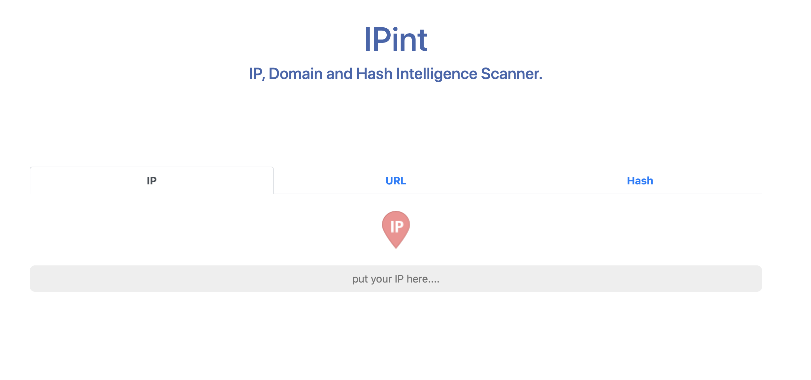
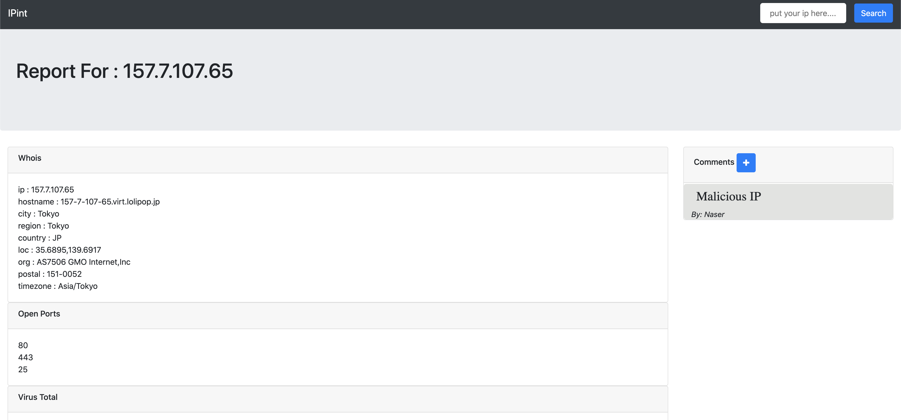

# IPintel

### Summery 

IP, Domain And Hash web application reputation scanner. *for internal use only*

Scan reputation in:

- Whois
- Open Ports
- Virus total
- OTX
- AbuseIPDB
- Twitter
- Meta Defender
- HonyDB


### Installation 

- clone the repo

```bash
$ git clone https://github.com/khanafeer/IPintel.git
```

-  install requirements.txt

```bash
$ cd IPintel/
$ pip3 install -r requirements.txt 
```

runserver

```bash
$ python3 manage.py runserver
```


### Usage

Open the website locally http://127.0.0.1:8000/ and enjoy 😊 

from the result's page you could add comments and scann for others from the same page







### TODO

- [ ] Add more scanners.
- [ ] Add scanner's parsers.
- [ ] Security code review (to be public)
- [ ] Upgrade Django.

